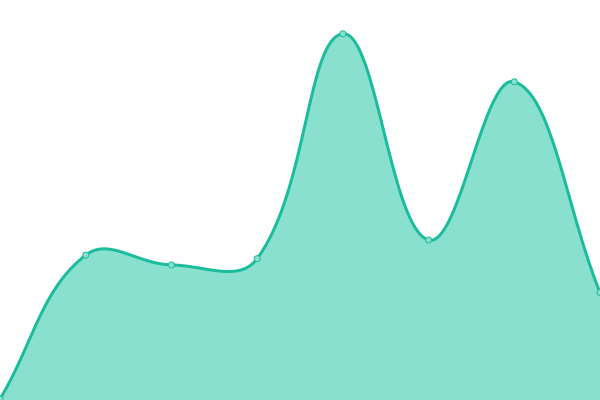
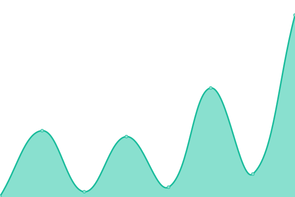
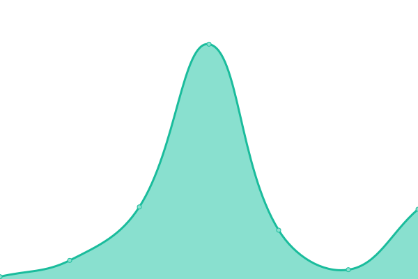
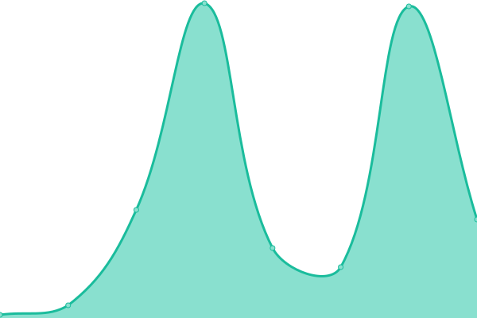
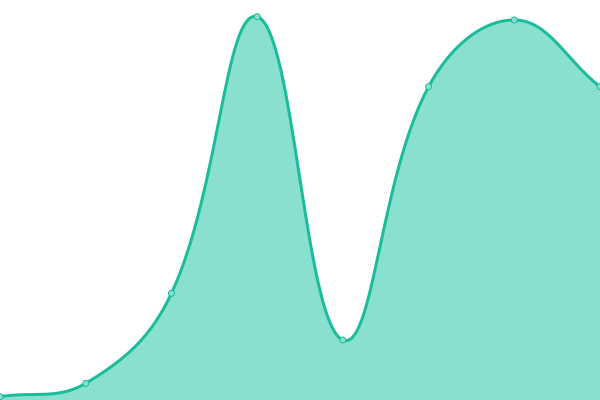
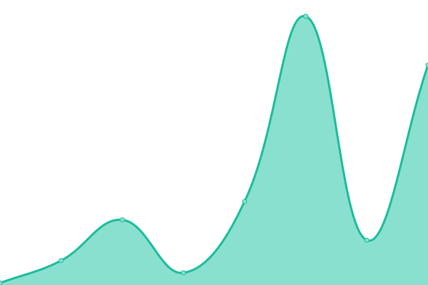
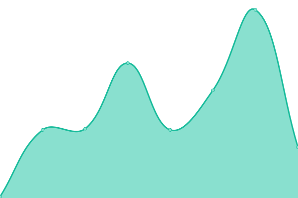
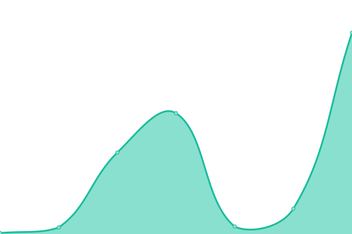

# [📈 Live Status](https://anonyme-unterverdiener.de/upptime-uadeutschland): <!--live status--> **🟩 All systems operational**

This repository contains the open-source uptime monitor and status page for [Underearners Anonymous Web-Service](https://uadeutschland.github.io), powered by [Upptime](https://github.com/upptime/upptime).

With [Upptime](https://upptime.js.org), you can get your own unlimited and free uptime monitor and status page, powered entirely by a GitHub repository. We use [Issues](https://github.com/uadeutschland/upptime-uadeutschland/issues) as incident reports, [Actions](https://github.com/uadeutschland/upptime-uadeutschland/actions) as uptime monitors, and [Pages](https://https://anonyme-unterverdiener.de/upptime) for the status page.

<!--start: status pages-->
<!-- This summary is generated by Upptime (https://github.com/upptime/upptime) -->
<!-- Do not edit this manually, your changes will be overwritten -->
<!-- prettier-ignore -->
| URL | Status | History | Response Time | Uptime |
| --- | ------ | ------- | ------------- | ------ |
|  [Homepage](https://anonyme-unterverdiener.de/) | 🟩 Up | [homepage.yml](https://github.com/uadeutschland/upptime-uadeutschland/commits/HEAD/history/homepage.yml) | 

 249ms
     
 | 

<a href="https://uadeutschland.github.io/upptime-uadeutschland/history/homepage">100.00%</a>
    

|  [12 Schritte](https://anonyme-unterverdiener.de/12schritte/) | 🟩 Up | [12-schritte.yml](https://github.com/uadeutschland/upptime-uadeutschland/commits/HEAD/history/12-schritte.yml) | 

 45ms
     
 | 

<a href="https://uadeutschland.github.io/upptime-uadeutschland/history/12-schritte">100.00%</a>
    

|  [Symptome](https://anonyme-unterverdiener.de/symptome/) | 🟩 Up | [symptome.yml](https://github.com/uadeutschland/upptime-uadeutschland/commits/HEAD/history/symptome.yml) | 

 44ms
     
 | 

<a href="https://uadeutschland.github.io/upptime-uadeutschland/history/symptome">100.00%</a>
    

|  [Werkzeuge](https://anonyme-unterverdiener.de/werkzeuge/) | 🟩 Up | [werkzeuge.yml](https://github.com/uadeutschland/upptime-uadeutschland/commits/HEAD/history/werkzeuge.yml) | 

 50ms
     
 | 

<a href="https://uadeutschland.github.io/upptime-uadeutschland/history/werkzeuge">100.00%</a>
    

|  [Meetings](https://anonyme-unterverdiener.de/meetings/) | 🟩 Up | [meetings.yml](https://github.com/uadeutschland/upptime-uadeutschland/commits/HEAD/history/meetings.yml) | 

 45ms
     
 | 

<a href="https://uadeutschland.github.io/upptime-uadeutschland/history/meetings">100.00%</a>
    

|  [Literatur](https://anonyme-unterverdiener.de/literatur/) | 🟩 Up | [literatur.yml](https://github.com/uadeutschland/upptime-uadeutschland/commits/HEAD/history/literatur.yml) | 

 42ms
     
 | 

<a href="https://uadeutschland.github.io/upptime-uadeutschland/history/literatur">100.00%</a>
    

|  [Chairvorlage](https://anonyme-unterverdiener.de/files/UA-Online-Chairvorlage-dt.pdf) | 🟩 Up | [chairvorlage.yml](https://github.com/uadeutschland/upptime-uadeutschland/commits/HEAD/history/chairvorlage.yml) | 

 61ms
     
 | 

<a href="https://uadeutschland.github.io/upptime-uadeutschland/history/chairvorlage">100.00%</a>
    

|  [Meetingsmappe Deutsch](https://anonyme-unterverdiener.de/files/UA%20Meetingsmappe%20Deutsch.pdf) | 🟩 Up | [meetingsmappe-deutsch.yml](https://github.com/uadeutschland/upptime-uadeutschland/commits/HEAD/history/meetingsmappe-deutsch.yml) | 

 49ms
     
 | 

<a href="https://uadeutschland.github.io/upptime-uadeutschland/history/meetingsmappe-deutsch">100.00%</a>
    

|  [Meetingsmappe DE / EN](https://anonyme-unterverdiener.de/files/UA_pages_en-de_new.pdf) | 🟩 Up | [meetingsmappe-de-en.yml](https://github.com/uadeutschland/upptime-uadeutschland/commits/HEAD/history/meetingsmappe-de-en.yml) | 

 48ms
     
 | 

<a href="https://uadeutschland.github.io/upptime-uadeutschland/history/meetingsmappe-de-en">100.00%</a>
    

|  [UA Reader DE / EN](https://anonyme-unterverdiener.de/files/UA_Reader_new.pdf) | 🟩 Up | [ua-reader-de-en.yml](https://github.com/uadeutschland/upptime-uadeutschland/commits/HEAD/history/ua-reader-de-en.yml) | 

 388ms
     
 | 

<a href="https://uadeutschland.github.io/upptime-uadeutschland/history/ua-reader-de-en">100.00%</a>
    

|  [Fragebogen C-PTSD](https://anonyme-unterverdiener.de/files/Fragebogen%20C-PTSD.pdf) | 🟩 Up | [fragebogen-c-ptsd.yml](https://github.com/uadeutschland/upptime-uadeutschland/commits/HEAD/history/fragebogen-c-ptsd.yml) | 

 43ms
     
 | 

<a href="https://uadeutschland.github.io/upptime-uadeutschland/history/fragebogen-c-ptsd">100.00%</a>
    

<!--end: status pages-->

[**Visit our status website →**](https://anonyme-unterverdiener.de/upptime-uadeutschland)

## 📄 License

- Powered by: [Upptime](https://github.com/upptime/upptime)
- Code: [MIT](./LICENSE) © [Underearners Anonymous Web-Service](uadeutschland.github.io)
- Data in the `./history` directory: [Open Database License](https://opendatacommons.org/licenses/odbl/1-0/)
